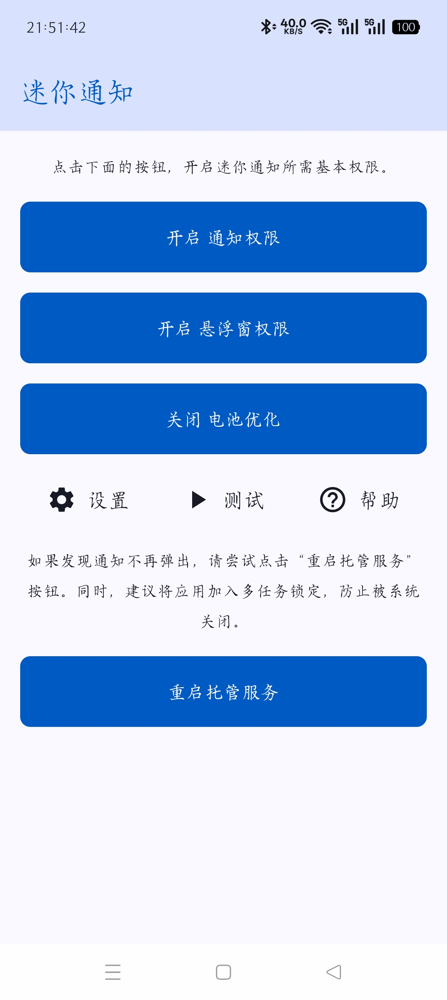
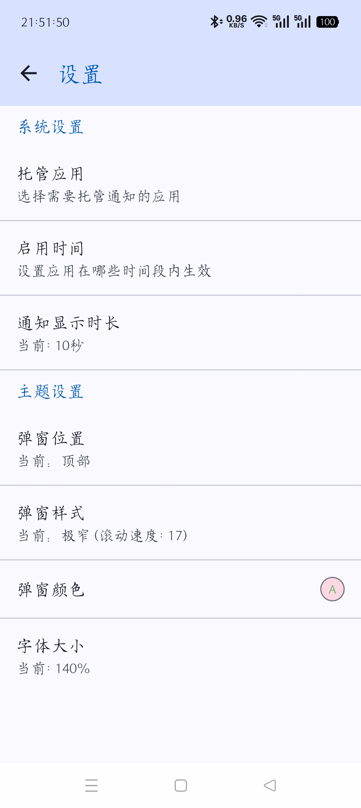
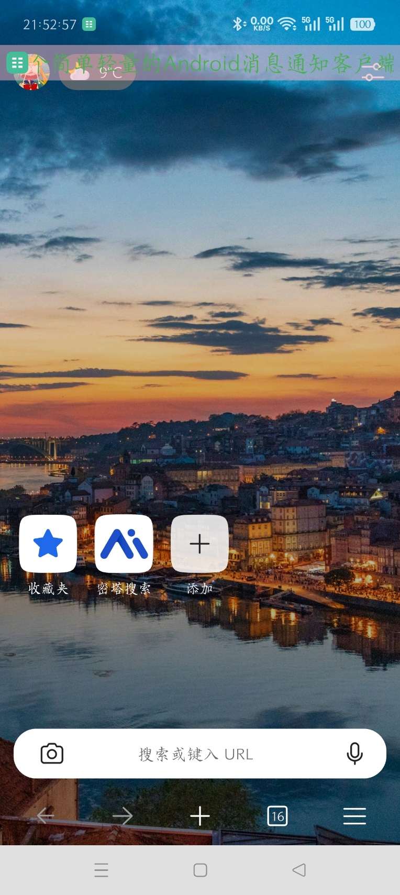

# 迷你通知

## 1.简介
一个用于托管安卓系统通知的小工具，采用浮窗展示通知，并支持透明度和颜色调节，提供极窄和横幅两种样式切换。

## 2.截图
### 主界面

### 设置页面

### 极窄样式弹窗

## 3.使用方法
按照主页说明开启通知权限/浮窗权限，关闭电池优化。
进入设置，必须要**配置需要托管的应用！** 否则不起作用。

注意：因为本应用是基于浮窗显示的用于替代系统的横幅通知，所以需要关闭你设置的被托管的应用的横幅通知。

## 4.作者的话
这个应用是我通过AI辅助写的，已经尽了最大的努力了，我对安卓开发真的不太懂，但是一直觉得系统浮窗太死板了，这么大，内容还老截断，又遮挡我的屏幕！真心不能忍。如果有大佬觉得我的应用思路不错，欢迎对我的应用进行改进，增加功能啥的，都是非常欢迎的。另外推荐一个好用的应用，我参考了下这位大佬的思路[heads-up](https://github.com/SimenCodes/heads-up)